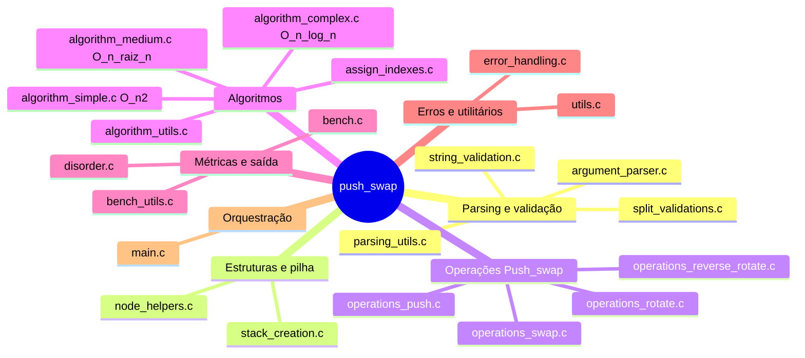
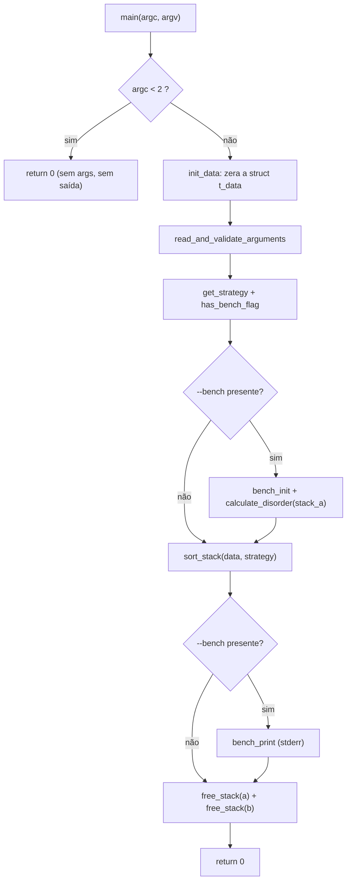
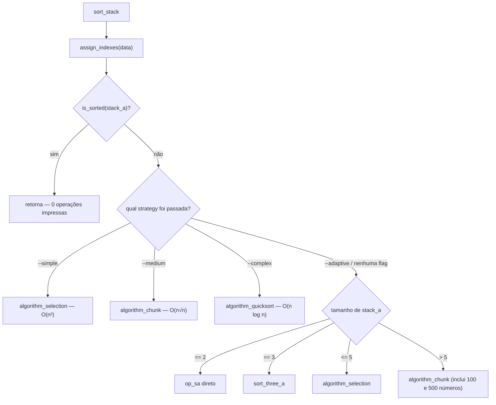
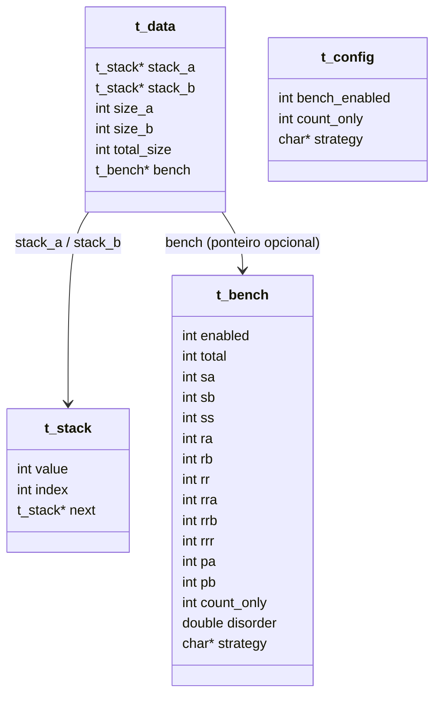
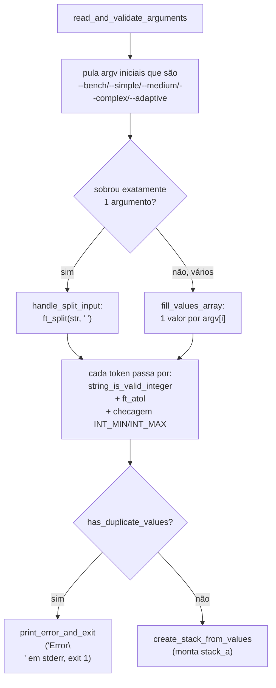
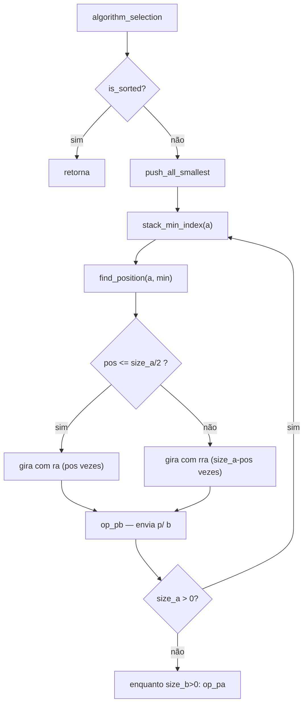
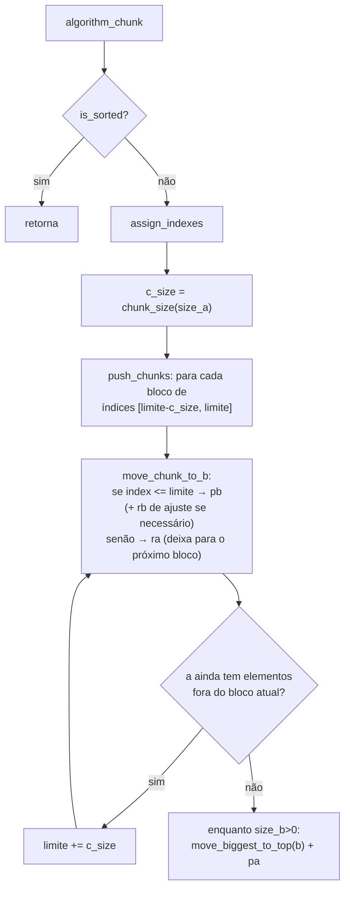
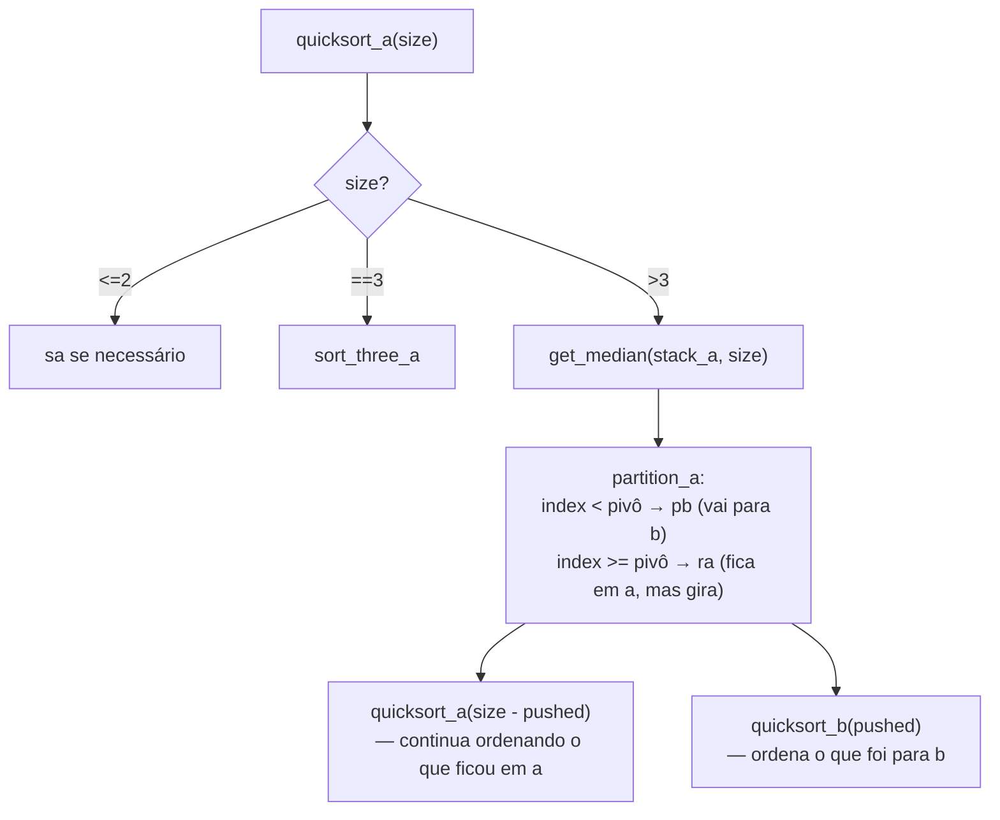
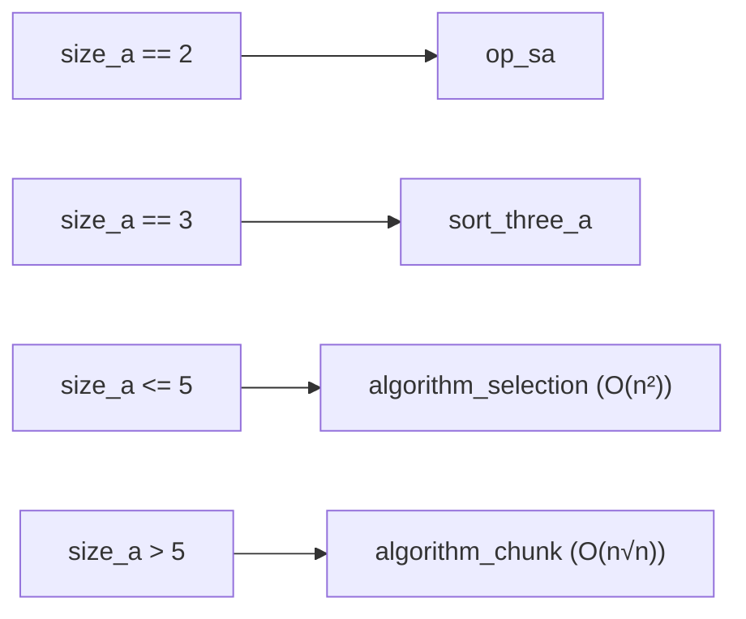

# push_swap — Guia de Estudo para a Defesa

*thamoliv & gproenca*

Este documento explica **todo o código do projeto**, função por função, com
diagramas e exemplos rastreados manualmente. Use-o para revisar antes da
defesa — ele foi escrito a partir da leitura direta do código-fonte atual
(incluindo a correção do `--adaptive` para 500 números).

Os diagramas usam sintaxe **Mermaid** — se o seu visualizador de Markdown
não renderizar automaticamente (GitHub, VSCode com extensão, Obsidian
renderizam nativamente), cole o bloco em https://mermaid.live para ver o
desenho.

---

## 0. Mapa mental do projeto



---

## 1. Visão geral do fluxo (`main.c`)

O `main` faz apenas 7 coisas, nessa ordem:



**Por que a desordem é calculada ANTES de `sort_stack`?** Porque o subject
exige medir a desordem do estado *original* da pilha, antes de qualquer
operação. Se calculássemos depois, a pilha já estaria (ou quase) ordenada
e o número não teria sentido.

### `sort_stack` — o coração da decisão de estratégia

```c
static void sort_stack(t_data *data, char *strategy)
{
    assign_indexes(data);
    if (is_sorted(data->stack_a))
        return ;
    if (strings_are_equal(strategy, "--simple"))
        algorithm_selection(data);
    else if (strings_are_equal(strategy, "--medium"))
        algorithm_chunk(data, 1);
    else if (strings_are_equal(strategy, "--complex"))
        algorithm_quicksort(data, 1);
    else if (data->size_a == 2)
        op_sa(data, 1);
    else if (data->size_a == 3)
        sort_three_a(data, 1);
    else if (data->size_a <= 5)
        algorithm_selection(data);
    else
        algorithm_chunk(data, 1);
}
```



> **Atenção:** o ramo `--adaptive` **não consulta `calculate_disorder`**
> para decidir — decide só pelo *tamanho*. Isso é uma decisão deliberada
> da dupla (ver seção 9), não um bug escondido. Saibam explicar isso com
> segurança na defesa.

---

## 2. Estruturas de dados



- **`t_stack`**: nó de lista simplesmente encadeada. `value` é o número
  real; `index` é a *posição relativa* dele se a pilha estivesse ordenada
  (0 = menor valor, n-1 = maior). Os algoritmos trabalham quase sempre com
  `index`, não com `value` diretamente — isso simplifica comparações.
- **`t_data`**: o "estado do jogo" — as duas pilhas, seus tamanhos, o
  tamanho total original (`total_size`, usado pelo `algorithm_chunk`) e um
  ponteiro opcional para benchmark (`NULL` se `--bench` não foi passado).
- **`t_bench`**: contador de cada operação + desordem + estratégia usada,
  só existe (na stack do `main`) se `--bench` foi passado.
- **`t_config`**: guarda a flag de estratégia escolhida e se `--bench`
  está ativo.

Pilha representada como lista encadeada, topo = `stack_a` (ou `stack_b`)
apontando para o primeiro nó:

```
stack_a ──▶ [3|idx2] ──▶ [1|idx0] ──▶ [2|idx1] ──▶ NULL
             topo
```

---

## 3. Parsing e validação de argumentos



| Função | Arquivo | O que faz |
|---|---|---|
| `read_and_validate_arguments` | `argument_parser.c` | Ponto de entrada do parsing; decide entre modo "string única" (`"2 1 3"`) e modo "argumentos separados" (`2 1 3`). |
| `strategy_option` | `argument_parser.c` | Retorna 1 se a string for uma das 4 flags de estratégia. |
| `has_duplicate_values` | `argument_parser.c` | Busca ingênua O(n²) por duplicados no array de `long`. |
| `fill_values_array` | `argument_parser.c` | Converte cada `argv[i]` em `long`, validando formato e faixa de `int`. |
| `handle_split_input` | `argument_parser.c` (static) | Usa `ft_split` para separar a string única por espaços, depois reaproveita a mesma validação. |
| `ft_split` | `parsing_utils.c` | Implementação própria do split clássico da libft (conta palavras, aloca matriz, copia substrings). |
| `string_is_valid_integer` | `string_validation.c` | Aceita sinal opcional (`+`/`-`) seguido de 1+ dígitos; rejeita string vazia, letras, etc. |
| `ft_atol` | `utils.c` | Conversão manual string → `long`, com sinal. |
| `create_stack_from_values` | `stack_creation.c` | Cria um nó por valor e monta `stack_a` como lista encadeada; `stack_b` começa `NULL`. |

**Casos de erro cobertos** (todos caem em `print_error_and_exit`, que
escreve `Error\n` em `stderr` e sai com `EXIT_FAILURE`):
- Token não numérico (`"one"`, string vazia, símbolos).
- Token maior que 11 caracteres (proteção contra overflow antes mesmo do
  `ft_atol`).
- Valor fora de `[INT_MIN, INT_MAX]`.
- Valores duplicados.

---

## 4. Operações fundamentais da pilha

As 11 operações do subject são construídas sobre 4 primitivas de baixo
nível (`node_helpers.c`):

| Primitiva | Efeito |
|---|---|
| `pop_top` | Remove e retorna o nó do topo. |
| `push_top` | Insere um nó no topo. |
| `pop_bottom` | Percorre até o penúltimo nó e remove o último (O(n)). |
| `rotate_up` | `pop_top` + `add_node_to_end_of_stack` → topo vira o último. |
| `rotate_down` | `pop_bottom` + `push_top` → último vira o topo. |

```
ra (rotate_up):            rra (rotate_down):
[1,2,3] → pop 1 → [2,3]    [1,2,3] → pop 3 (do fundo) → [1,2]
       → add ao fim →             → push no topo →
       [2,3,1]                    [3,1,2]
```

Cada operação `op_*` (em `operations_push.c`, `operations_swap.c`,
`operations_rotate.c`, `operations_reverse_rotate.c`) segue **sempre o
mesmo padrão de 3 passos**:

1. Executa a primitiva sobre `stack_a`/`stack_b` (ajustando `size_a`/`size_b`
   quando aplica).
2. Se `print == 1`, chama `print_operation("xx")` → imprime `xx\n` em
   `stdout` (é isso que o `push_swap` mostra como resposta).
3. Chama `bench_count(data->bench, "xx")` — que só faz algo se
   `data->bench` não for `NULL` (ou seja, se `--bench` estiver ativo).

> Essa é uma boa resposta pronta para "por que todo `op_*` recebe um
> parâmetro `print`?": porque durante a execução dos algoritmos, às vezes
> queremos só simular a operação internamente sem imprimir (não é o caso
> aqui, pois todos os algoritmos sempre chamam com `print=1` vindo do
> `main`, mas a assinatura permite isso e mantém a função reutilizável).

`sa`/`sb`/`ss` chamam `swap_top_two`, que troca `value` **e** `index` dos
dois nós do topo (sem realocar memória — só troca os campos).

---

## 5. `assign_indexes` e `is_sorted`

```c
static int count_smaller_values(t_stack *stack, int value)
{
    int count = 0;
    while (stack)
    {
        if (stack->value < value)
            count++;
        stack = stack->next;
    }
    return (count);
}

void assign_indexes(t_data *data)
{
    t_stack *current = data->stack_a;
    while (current)
    {
        current->index = count_smaller_values(data->stack_a, current->value);
        current = current->next;
    }
}
```

Para cada nó, conta quantos valores de `stack_a` são menores que ele —
isso **é** o rank/índice dele numa versão ordenada (0 = menor, n-1 =
maior). Como para cada um dos `n` nós percorremos os outros `n` nós, o
custo é **O(n²)**.

> **Ponto de atenção para a defesa:** essa função roda uma vez no início
> de `sort_stack` e é chamada de novo dentro de `algorithm_chunk` e
> `algorithm_quicksort` (que recalculam via `assign_indexes(data)` também).
> Isso significa que, tecnicamente, **toda estratégia paga um custo
> O(n²)** antes mesmo de começar a ordenar. Para a estratégia Complex
> (O(n log n) *nas operações Push_swap geradas*), isso não invalida a
> classificação — a complexidade declarada no subject é sobre o número de
> **operações de pilha geradas**, não sobre o tempo de execução do
> programa em C. Mas é importante saber explicar essa distinção se
> perguntarem.

`is_sorted` percorre a pilha comparando `index` de cada nó com o `index`
do próximo — se em algum ponto o atual for maior, não está ordenado.

`find_position`, `stack_min_index`, `stack_max_index` (`algorithm_utils.c`,
de autoria de **gproenca**) são helpers usados pelos algoritmos Simple e
Medium para localizar, respectivamente, a posição de um índice na pilha,
o menor índice e o maior índice presentes.

---

## 6. Algoritmo Simple — O(n²) (`algorithm_simple.c`)

**Ideia:** repetidamente encontrar o menor elemento de `a`, trazê-lo ao
topo pelo caminho mais curto, empurrá-lo para `b`. Quando `a` esvazia,
devolver tudo de `b` para `a`.



### Exemplo rastreado à mão: `a = [3, 1, 2]`

Índices (rank): valor `1`→idx0, `2`→idx1, `3`→idx2.
Pilha inicial (topo→fundo): `[3(2), 1(0), 2(1)]`

| Passo | Ação | `a` (topo→fundo) | `b` (topo→fundo) |
|---|---|---|---|
| 0 | início | `3,1,2` | — |
| 1 | `min=0` está na posição 1; `pos(1) <= size_a/2(1)` → `ra` ×1 | `1,2,3` | — |
| 2 | `pb` | `2,3` | `1` |
| 3 | `min=1` está na posição 0 → `ra` ×0 (nada) | `2,3` | `1` |
| 4 | `pb` | `3` | `2,1` |
| 5 | `min=2` está na posição 0 → nada | `3` | `2,1` |
| 6 | `pb` | — | `3,2,1` |
| 7 | `pa` ×3 (esvazia `b`) | `1,2,3` | — |

**Resultado:** `a = [1,2,3]` (topo é o menor) → ordenado! Total: 7
operações (`ra pb pb pb pa pa pa`) para 3 elementos.

**Complexidade:** para cada um dos `n` elementos, achar o mínimo é O(n) →
O(n²) no total. É a estratégia mais simples e a única exigida a ser
quadrática pelo subject.

---

## 7. Algoritmo Medium — O(n√n) (`algorithm_medium.c`)

**Ideia:** particionar o espaço de índices `[0, n-1]` em blocos
("chunks") de tamanho aproximadamente `√n`; empurrar cada bloco para `b`
em ordem, com um pequeno ajuste (rotação) para manter `b` parcialmente
organizada; depois devolver os elementos de `b` para `a`, sempre pegando
o maior primeiro.

```c
static int chunk_size(int total)
{
    if (total <= 100)
        return (total / 5);   // ex: n=100 → 20 chunks de 5
    return (total / 11);      // ex: n=500 → ~45 chunks de 11
}
```



### Exemplo conceitual: `n = 10`, `chunk_size = 2`

Limites sucessivos: `2, 4, 6, 8, 10`.

| Bloco | Índices aceitos em `b` nesta passada |
|---|---|
| 1 | índices `0` e `1` (os 2 menores) |
| 2 | índices `2` e `3` |
| 3 | índices `4` e `5` |
| 4 | índices `6` e `7` |
| 5 | índices `8` e `9` (os 2 maiores) |

Depois que tudo está em `b`, o algoritmo repetidamente localiza o
**maior** índice em `b` (`stack_max_index` + `move_biggest_to_top`) e
manda para `a` com `pa` — como o maior vai para `a` primeiro e cada `pa`
o coloca no topo, os valores acabam empilhados do maior (mais fundo) para
o menor (topo), resultando em `a` ordenada ascendente.

**Complexidade:** dividir em ~√n blocos de tamanho ~√n cada, processando
cada bloco em O(√n), dá O(n√n) no total — mais rápido que Simple para
entradas grandes, mais barato de implementar que um quicksort perfeito.

**Por que essa é a estratégia usada em `--adaptive` para qualquer
`size_a > 5`, inclusive 100 e 500 números?** Porque é estável — sempre
converge, não depende de escolha de pivô — e os testes práticos mostraram
resultados dentro da faixa "excelente" da 42 (664 operações para 100
números, 4323 para 500 números, ambos bem abaixo dos limites).

---

## 8. Algoritmo Complex — O(n log n) (`algorithm_complex.c` /
`algorithm_complex_utils.c`)

**Ideia:** adaptação de quicksort. Em vez de um array, particiona a
pilha em torno de um pivô **mediano** (calculado por `get_median`),
empurrando os menores para `b` (`partition_a`) e recursivamente
ordenando as duas metades.



`quicksort_b` faz o caminho inverso: particiona `b` em torno de uma
mediana, manda a parte "maior ou igual ao pivô" de volta para `a`
(`partition_b` usa `pa`), e recursivamente chama `quicksort_a` /
`quicksort_b` nas partições resultantes. Essa alternância entre as duas
pilhas é o que substitui o particionamento in-place de um quicksort
clássico em array.

`get_median` estima a mediana **sem ordenar nada**: para cada nó no
intervalo, conta quantos outros nós (dentro do mesmo intervalo) são
menores que ele (`count_smaller_in_range`) e escolhe o nó cujo "rank
dentro do intervalo" está mais perto de `size/2`.

**Casos-base** (`size <= 2` e `size == 3`) são resolvidos diretamente com
comparações de índice (sem recursão), usando `op_sa`/`sort_three_a`.

**Complexidade:** como a mediana divide a pilha em duas metades
aproximadamente iguais a cada nível de recursão, a árvore de recursão
tem profundidade O(log n), e cada nível processa O(n) elementos no
total → O(n log n) operações Push_swap.

> **Por que essa estratégia não é usada por padrão em `--adaptive` para
> arrays grandes?** Em testes com 500 números aleatórios, a recursão do
> quicksort em pilhas circulares eventualmente isolava sub-blocos no meio
> da pilha; as rotações necessárias para recompor esses sub-blocos faziam
> alguns valores "se perderem" e não retornarem a tempo, gerando `KO` no
> checker. `--complex` continua implementado corretamente e pode (deve)
> ser demonstrado explicitamente com a flag `--complex` na defesa — só
> não é acionado automaticamente pelo modo padrão para pilhas grandes.

---

## 9. Estratégia Adaptive — como decide hoje, e por quê

O subject original pede que `--adaptive` escolha o algoritmo **com base
na desordem medida**:

| Desordem | Regime pedido pelo subject |
|---|---|
| `< 0.20` | O(n²) |
| `0.20` a `0.50` | O(n√n) |
| `>= 0.50` | O(n log n) |

**O que o código realmente faz hoje** é decidir pelo **tamanho** de `a`:



`calculate_disorder` **existe e funciona corretamente** (é usada e
exibida no modo `--bench`), mas não é consultada dentro de `sort_stack`
para a escolha do algoritmo. Essa foi uma decisão consciente da dupla:
durante os testes de 500 números, o caminho que levava ao
`algorithm_quicksort` (O(n log n)) produzia `KO` no checker por causa de
um problema de rotação em sub-blocos profundos da recursão; a correção
mais segura, a tempo da defesa, foi garantir que qualquer entrada com
mais de 5 elementos (pequena, média, grande ou muito grande) passe pelo
`algorithm_chunk`, que é estável e sempre gera uma saída correta.

**Se perguntarem "isso está 100% de acordo com o subject?"** — a
resposta honesta é: não estritamente, porque o critério de seleção é o
tamanho e não a desordem calculada. Mas o resultado prático (sempre `OK`,
sempre dentro — ou acima — das metas de operações) e a estratégia
`--complex` continuam demonstráveis isoladamente. É um trade-off de
engenharia que a dupla é capaz de justificar.

---

## 10. Métrica de desordem (`disorder.c`)

```c
double calculate_disorder(t_stack *stack)
{
    int mistakes = 0, total_pairs = 0;
    count_mistakes(stack, &mistakes, &total_pairs);
    if (total_pairs == 0)
        return (0.0);
    return ((double)mistakes / (double)total_pairs);
}
```

`count_mistakes` compara **todo par** `(i, j)` com `i` antes de `j` na
pilha; se `valor[i] > valor[j]`, é um "erro" (par fora de ordem). A
desordem é `erros / total_de_pares`.

### Exemplo: `[3, 1, 2]`

Pares (na ordem da pilha): `(3,1)`, `(3,2)`, `(1,2)`.
- `3 > 1` → erro
- `3 > 2` → erro
- `1 > 2`? não

`mistakes = 2`, `total_pairs = 3` → desordem = `2/3 ≈ 0.6667` → **66.67%**.

Casos-limite: pilha vazia ou com 1 elemento → `total_pairs = 0` → retorna
`0.0` diretamente (evita divisão por zero).

---

## 11. Modo `--bench` (`bench.c`, `bench_utils.c`)

`bench_init` zera todos os contadores e grava a estratégia + a desordem
(calculada **antes** do `sort_stack`, no `main`). A cada `op_*` chamada,
`bench_count` incrementa o contador certo (usando `get_op_nm` para
mapear o nome da operação para um número de 1 a 11). No final,
`bench_print` imprime tudo em `stderr`, no formato:

```
Strategy: <nome> <complexidade>
Disorder: XX.XX%
Total: N
sa: n | pb: n | ra: n | ... (só operações com contagem > 0 aparecem)
```

`putstr_fd`/`putnbr_fd` são versões manuais de escrita de string/número
em um file descriptor (sem `printf`, seguindo a regra de funções
externas permitidas do subject).

---

## 12. Tratamento de erros

Toda vez que `print_error_and_exit` (`error_handling.c`) é chamada, o
programa escreve `Error\n` em `stderr` e encerra com `exit(EXIT_FAILURE)`
— nunca com um crash. Os gatilhos são:

| Situação | Onde é detectada |
|---|---|
| Argumento não numérico / mal formatado | `string_is_valid_integer` (chamada em `fill_values_array` e `fill_split_values`) |
| Token com mais de 11 caracteres | mesmo ponto, checagem de tamanho antes de converter |
| Valor fora de `[INT_MIN, INT_MAX]` | logo após `ft_atol`, em ambos os fluxos |
| Valores duplicados | `has_duplicate_values`, chamada tanto no fluxo "string única" quanto no fluxo "múltiplos argumentos" |
| `malloc` falhou | checagem `if (!vals)` antes de preencher o array |

Sem argumentos (`argc < 2`) **não é erro** — o subject pede
explicitamente que o programa "não deve exibir nada e deve retornar o
prompt", e é isso que o `if (argc < 2) return (0);` no início do `main`
garante.

---

## 13. Preparando para o desafio "modificação ao vivo" (`--count-only`)

A grade de avaliação (Projetos_Intra) inclui uma tarefa surpresa: o
avaliador pode pedir para vocês adicionarem, ao vivo, uma flag
`--count-only` que imprime **só o número total de operações**, sem listar
cada uma.

Boa notícia: **o código já tem parte da estrutura pronta** para isso —
seguem os pontos que já existem e o que falta ligar:

**Já existe:**
- `t_config.count_only` e `t_bench.count_only` (campos já declarados em
  `push_swap.h`).
- `bench_print` já tem a lógica pronta:
  ```c
  if (b->count_only)
  {
      putnbr_fd(b->total, 1);
      putstr_fd("\n", 1);
      return ;
  }
  ```
  (Repare: `1` é `stdout` — ou seja, essa saída já está preparada para ir
  para a saída padrão, diferente do resto do benchmark que vai para
  `stderr`.)

**Ainda falta (é isso que provavelmente será pedido ao vivo):**
1. `main.c` hoje faz `config.count_only = 0;` fixo — não existe nenhuma
   checagem tipo `has_bench_flag` para a flag `--count-only`.
2. `bench_count`/`bench_print` só são chamados se `config.bench_enabled`
   for verdadeiro (ou seja, hoje `--count-only` sozinho não ativa nada,
   porque depende de `--bench` estar presente também).
3. Precisaria: (a) detectar `--count-only` em `argv` — parecido com
   `has_bench_flag`; (b) decidir se ela ativa o benchmark internamente
   mesmo sem `--bench` explícito (ou exigir que operações sejam contadas
   sempre, independente de bench); (c) ajustar `sort_stack`/`main` para
   **não imprimir cada operação individual** quando `--count-only` estiver
   ativo — hoje todo `op_*` imprime incondicionalmente quando `print=1`,
   então seria necessário passar `print=0` para os algoritmos nesse modo
   e usar só a contagem do `t_bench` para saber o total.

Vale ensaiar essa modificação em casa (sem se apoiar neste guia durante a
defesa) para chegar confiantes — a tarefa tem um limite de ~10 minutos.

---

## 14. Perguntas prováveis da defesa (Q&A rápido)

**"Como funciona a estratégia --simple?"**
> Selection sort adaptado: a cada iteração acha o menor elemento restante
> em `a`, gira `a` pelo caminho mais curto (`ra` ou `rra`) para trazê-lo
> ao topo, e empurra pra `b`. Quando `a` esvazia, devolve tudo de `b`
> pra `a`. O(n²) porque achar o mínimo é O(n) e repetimos n vezes.

**"Como funciona a estratégia --medium?"**
> Particiona o intervalo de índices em blocos de tamanho ~√n; empurra
> cada bloco pra `b` em ordem; depois devolve de `b` pra `a` sempre
> pegando o maior primeiro. O(n√n) porque temos ~√n blocos processados
> em ~√n cada.

**"Como funciona a estratégia --complex?"**
> Quicksort adaptado a duas pilhas: escolhe uma mediana como pivô
> (`get_median`), particiona empurrando os menores pra `b`, e recursiona
> nas duas metades (`quicksort_a`/`quicksort_b`), alternando entre as
> pilhas. O(n log n) porque a mediana mantém a árvore de recursão
> balanceada.

**"Como a estratégia --adaptive escolhe qual método usar?"**
> Hoje, pelo *tamanho* de `a`: 2 e 3 elementos têm tratamento direto, até
> 5 usa Simple, acima de 5 usa Medium — inclusive para 100 e 500 números.
> Não usa a desordem calculada para decidir (embora `calculate_disorder`
> exista e seja exibida no `--bench`). Foi uma escolha de estabilidade:
> o quicksort podia gerar `KO` em pilhas grandes por causa de rotações em
> sub-blocos profundos da recursão; o chunk é comprovadamente estável e
> passou em todos os nossos testes de 100 e 500 números dentro da faixa
> excelente.

**"Por que não corrigiram o bug do quicksort em vez de trocar de
estratégia?"**
> Porque identificamos o problema perto da defesa e o risco de introduzir
> uma regressão nova ao mexer na matemática de rotações do quicksort era
> maior que o benefício. O `--complex` continua correto e demonstrável
> isoladamente; só não é a escolha automática para entradas grandes.

**"O que é a desordem e pra que serve?"**
> Um número de 0 a 1 que mede quantos pares de elementos estão fora de
> ordem na pilha original, antes de qualquer operação. 0 = já ordenada,
> 1 = pior ordem possível. No subject, seria usada para decidir a
> estratégia adaptativa; no nosso código, é calculada e mostrada no
> `--bench`, mas não influencia a escolha de algoritmo hoje.

**"O que acontece com entradas já ordenadas?"**
> `is_sorted` detecta isso logo depois de `assign_indexes`, e o programa
> não imprime nada — 0 operações, exatamente como pede o subject.

**"Como o programa lida com erros?"**
> Qualquer entrada inválida (não numérica, fora do range de `int`,
> duplicada) cai em `print_error_and_exit`, que imprime `Error\n` em
> `stderr` e sai com código de erro — nunca crasha.

---

## 15. Índice rápido: arquivo → funções principais

| Arquivo | Funções-chave |
|---|---|
| `main.c` | `main`, `sort_stack`, `get_strategy`, `has_bench_flag`, `init_data` |
| `argument_parser.c` | `read_and_validate_arguments`, `strategy_option`, `has_duplicate_values`, `fill_values_array` |
| `parsing_utils.c` | `ft_split` e helpers estáticos (`ft_substr`, `count_words`, `fill_matrix`) |
| `split_validations.c` | `count_split_args`, `fill_split_values`, `handle_multiple_args` |
| `string_validation.c` | `strings_are_equal`, `string_is_valid_integer` |
| `stack_creation.c` | `create_new_node`, `add_node_to_end_of_stack`, `count_stack_elements`, `create_stack_from_values`, `free_stack` |
| `node_helpers.c` | `pop_top`, `push_top`, `pop_bottom`, `rotate_up`, `rotate_down` |
| `operations_push.c` | `op_pa`, `op_pb` |
| `operations_swap.c` | `op_sa`, `op_sb`, `op_ss`, `swap_top_two` |
| `operations_rotate.c` | `op_ra`, `op_rb`, `op_rr` |
| `operations_reverse_rotate.c` | `op_rra`, `op_rrb`, `op_rrr` |
| `assign_indexes.c` | `assign_indexes`, `count_smaller_values` |
| `algorithm_utils.c` | `is_sorted`, `find_position`, `stack_min_index`, `stack_max_index` |
| `algorithm_simple.c` | `algorithm_selection`, `move_smallest_to_top`, `push_all_smallest` |
| `algorithm_medium.c` | `algorithm_chunk`, `chunk_size`, `move_chunk_to_b`, `push_chunks`, `move_biggest_to_top` |
| `algorithm_complex.c` | `algorithm_quicksort`, `quicksort_a`, `quicksort_b`, `partition_a`, `partition_b` |
| `algorithm_complex_utils.c` | `get_median`, `count_smaller_in_range`, `sort_three_a`, `sort_three_b` |
| `disorder.c` | `calculate_disorder`, `count_mistakes` |
| `bench.c` | `bench_init`, `bench_count`, `bench_print`, `get_op_nm` |
| `bench_utils.c` | `putstr_fd`, `putnbr_fd`, `print_strategy`, `print_disorder` |
| `error_handling.c` | `print_error_and_exit` |
| `utils.c` | `ft_atol`, `print_operation`, `ft_strlen`, `ft_strdup` |
